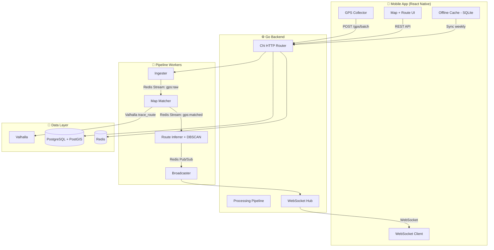
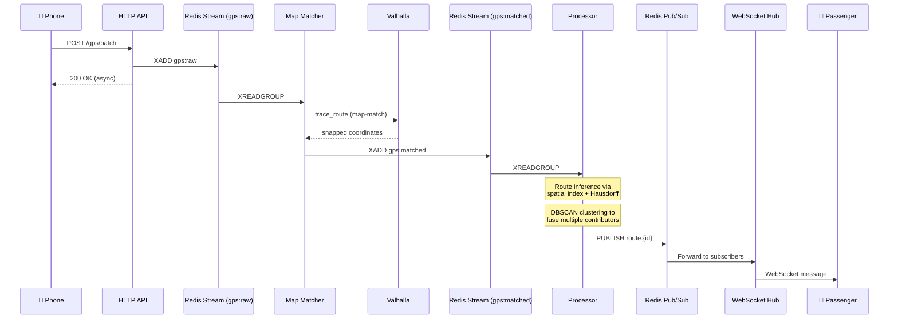
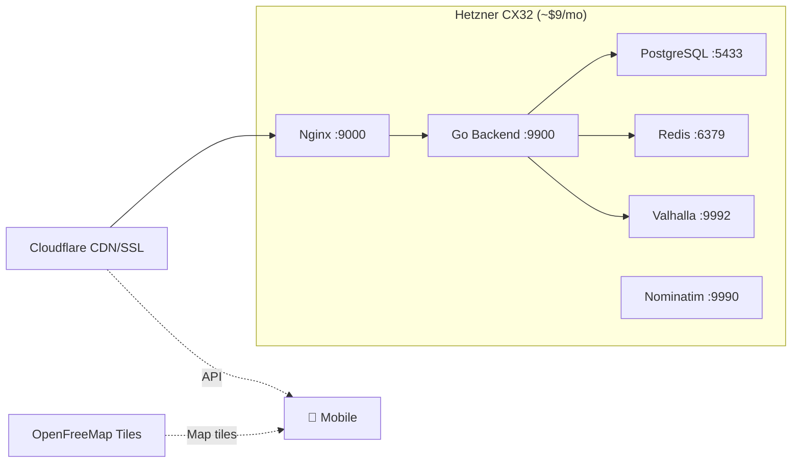

# Architecture

Mansariya is a monorepo with three layers: a Go backend, a React Native mobile app, and Docker-based infrastructure.

## System Overview



## Tech Stack

<CardGroup cols={2}>
  <Card title="Backend" icon="server">
    **Go 1.23+** with Chi v5 router, pgx v5 for PostgreSQL, go-redis v9.
    Single binary, ~15MB. Handles HTTP, WebSocket, and pipeline workers in one process.
  </Card>
  <Card title="Mobile" icon="mobile">
    **React Native** (bare workflow) with TypeScript.
    MapLibre for maps, Zustand for state, op-sqlite for offline data.
    Trilingual: Sinhala, Tamil, English.
  </Card>
  <Card title="Database" icon="database">
    **PostgreSQL 16 + PostGIS** for spatial queries.
    pg_trgm for fuzzy trilingual search.
    golang-migrate for schema migrations.
  </Card>
  <Card title="Real-time" icon="bolt">
    **Redis** Streams for pipeline processing,
    Pub/Sub for live broadcast,
    Hash for bus positions (5min TTL).
  </Card>
</CardGroup>

## Data Flow

### GPS Ingestion Pipeline

The pipeline runs as goroutines inside the Go binary, connected by Redis Streams:



### Pipeline Stages

| Stage | Input | Output | What It Does |
|-------|-------|--------|--------------|
| **Ingester** | GPS batch (HTTP) | `gps:raw` stream | Validates, serializes, pushes to Redis Stream |
| **Map Matcher** | `gps:raw` stream | `gps:matched` stream | Snaps GPS to roads via Valhalla Meili |
| **Processor** | `gps:matched` stream | Redis Pub/Sub | Infers route, clusters contributors, calculates speed/bearing |
| **Broadcaster** | Pub/Sub messages | WebSocket clients | Forwards to all subscribers of that route |

## Monorepo Layout

```
mansariya/
├── backend/              # Go backend (single binary)
│   ├── cmd/server/       # Main entry point
│   ├── cmd/bootstrap/    # Route data bootstrapper
│   ├── cmd/simulator/    # GPS traffic simulator
│   ├── internal/
│   │   ├── config/       # Environment config
│   │   ├── handler/      # HTTP handlers
│   │   ├── model/        # Domain types
│   │   ├── pipeline/     # Stream workers
│   │   ├── server/       # Router + middleware
│   │   ├── service/      # Business logic (ETA)
│   │   ├── spatial/      # R-tree, Hausdorff, DBSCAN
│   │   ├── store/        # PostgreSQL queries
│   │   ├── valhalla/     # Valhalla client
│   │   └── ws/           # WebSocket hub
│   ├── migrations/       # SQL migrations
│   └── api/              # OpenAPI spec
├── mobile/               # React Native app
│   └── src/
│       ├── components/   # UI components
│       ├── screens/      # App screens
│       ├── stores/       # Zustand state
│       ├── services/     # API, WS, location
│       └── i18n/         # Translations
├── infra/                # Docker, nginx, Valhalla config
├── data/                 # NTC route data files
└── docs/                 # This documentation (Mintlify)
```

## Infrastructure



All services run on a single $9/month Hetzner CX32 VPS via Docker Compose. Cloudflare provides CDN and SSL termination.
