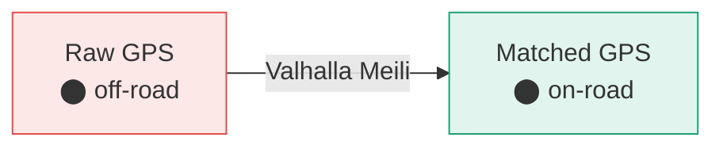
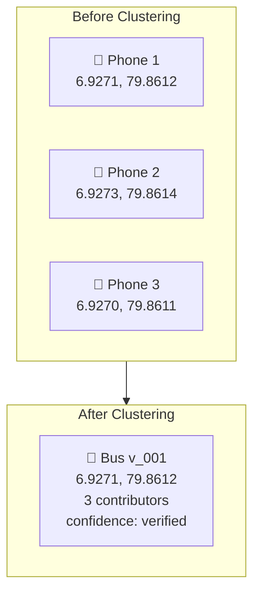
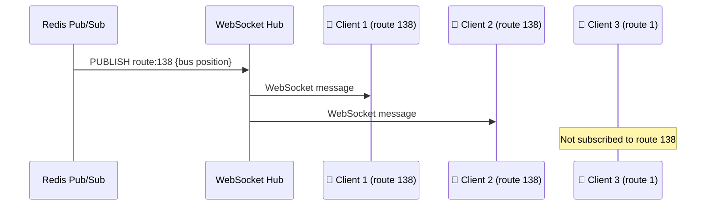

# GPS Processing Pipeline

The pipeline transforms noisy smartphone GPS into accurate, real-time bus positions through four stages connected by Redis Streams.

## Pipeline Overview


## Stage 1: Ingester

**File:** `internal/pipeline/ingester.go`

The mobile app collects GPS observations every 5 seconds and batches them:

```json
{
  "device_hash": "a1b2c3d4",
  "session_id": "sess_001",
  "pings": [
    {"lat": 6.9271, "lng": 79.8612, "ts": 1711540800, "acc": 12, "spd": 8.3, "brg": 45}
  ]
}
```

The ingester:
1. Validates the batch (device_hash, session_id, at least one ping)
2. Serializes to JSON
3. Pushes to Redis Stream `gps:raw` via `XADD`
4. Returns `200 OK` immediately — all processing is async

<Info>
The device hash is a one-way hash of the device UUID that **rotates every 24 hours**, making it impossible to track individual users over time.
</Info>

## Stage 2: Map Matcher

**File:** `internal/pipeline/mapmatcher.go`

Raw GPS is noisy — a phone might report a position 15 meters off the road. The map matcher uses **Valhalla Meili** to snap GPS points to the road network.



**How it works:**
1. Reads from Redis Stream `gps:raw` (consumer group)
2. Sends GPS trace to Valhalla's `trace_route` endpoint
3. Valhalla uses Hidden Markov Model to find the most likely road path
4. Writes matched points to Redis Stream `gps:matched`

**Valhalla config highlights:**
- `search_radius: 50m` — how far from a road to search
- `gps_accuracy: 15m` — expected phone GPS accuracy
- `turn_penalty_factor: 50` — discourages unlikely turns
- `breakage_distance: 2000m` — max gap before breaking the trace

## Stage 3: Processor (Route Inference + Clustering)

**File:** `internal/pipeline/processor.go`

This is where the magic happens. The processor:

### Route Inference
Uses a **spatial R-tree index** of all known route polylines. For each matched trace:
1. Queries the R-tree for candidate routes within the trace's bounding box
2. Computes **Hausdorff distance** between the trace and each candidate route
3. The closest match (below threshold) is the inferred route

### DBSCAN Clustering
When multiple phones are on the same bus, their GPS traces cluster together. **DBSCAN** (Density-Based Spatial Clustering) fuses them:



- **1 contributor** → `confidence: "low"`
- **2 contributors** → `confidence: "good"`
- **3+ contributors** → `confidence: "verified"`

### Output
Writes fused bus positions to Redis:
- `bus:{vid}:pos` hash (lat, lng, speed, bearing, route_id, confidence) with 5-min TTL
- Publishes to Redis Pub/Sub channel `route:{routeID}`

## Stage 4: Broadcaster

**File:** `internal/pipeline/broadcaster.go`

The broadcaster bridges Redis Pub/Sub to WebSocket clients:

1. Subscribes to `route:*` Pub/Sub channels
2. For each message, extracts the route ID
3. Forwards the bus position JSON to all WebSocket clients subscribed to that route



## Performance

| Metric | Value |
|--------|-------|
| End-to-end latency (phone → display) | < 2 seconds |
| GPS batch processing | ~50ms per batch |
| Map matching (Valhalla) | ~100ms per trace |
| Route inference | ~5ms per trace |
| Redis Stream throughput | 10,000+ msgs/sec |
