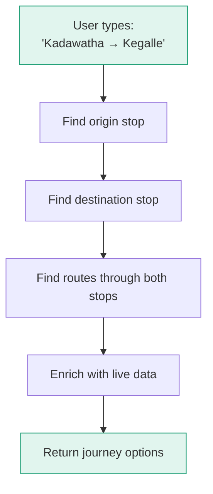
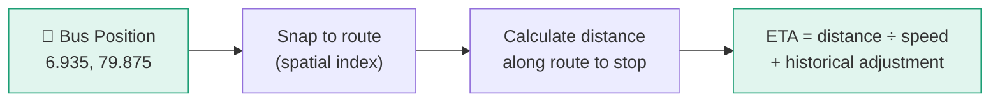

# Journey Planning

Mansariya helps passengers find which bus to take from point A to point B, with live ETA and fare estimates.

## How It Works



### Step 1: Stop Search

The API searches for stops by name using PostgreSQL's `pg_trgm` fuzzy matching. This works across all three languages:

- English: "Kadawatha"
- Sinhala: "කඩවත"
- Tamil: "கடவத்தை"

### Step 2: Route Matching

Once origin and destination stops are identified, the system queries the `route_stops` table to find all routes that pass through both stops in the correct order.

### Step 3: Journey Enrichment

Each journey option is enriched with:

| Data | Source |
|------|--------|
| Board/exit stop details | `route_stops` table (order, distance, fare) |
| Estimated duration | `typical_duration_min` from stop data |
| Fare estimate | `fare_from_start_lkr` difference |
| Live bus count | Redis (active buses on this route) |
| Next bus ETA | ETA service (real-time calculation) |

## API Response

```json
{
  "origin": {"id": "s001", "name_en": "Kadawatha", ...},
  "destination": {"id": "s050", "name_en": "Kegalle", ...},
  "journeys": [
    {
      "route": {"id": "1", "name_en": "Colombo - Kandy", ...},
      "board_stop": {"stop_order": 3, "stop_name_en": "Kadawatha", ...},
      "exit_stop": {"stop_order": 18, "stop_name_en": "Kegalle", ...},
      "stops_between": 15,
      "estimated_duration_min": 90,
      "fare_lkr": 280,
      "live_bus_count": 3,
      "next_bus_eta_min": 12
    }
  ]
}
```

## ETA Calculation

The ETA service (`internal/service/eta.go`) estimates when each active bus will reach a given stop:



1. **Snap** the bus's current position to the route polyline
2. **Calculate** the remaining distance along the route to the target stop
3. **Estimate** arrival time using current speed and historical trip segment data
4. **Assign confidence** based on contributor count

## Stop Autocomplete

The `/api/v1/stops/search?q=kada` endpoint powers the journey planner's autocomplete:

- Returns up to 10 matching stops
- Fuzzy matching handles typos
- Works in all three languages
