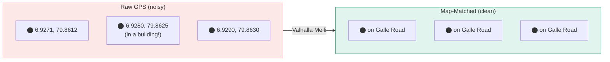
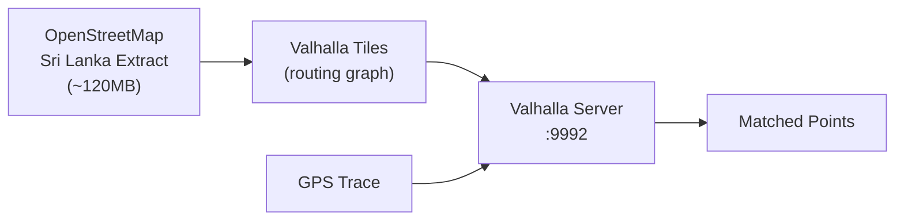

# Map Matching

Map matching is the process of taking noisy GPS coordinates and snapping them to the most likely path on the road network. Mansariya uses **Valhalla Meili**, a Hidden Markov Model-based map matcher.

## Why Map Matching?

Smartphone GPS has 10-20 meter accuracy. Without map matching, bus positions would appear off-road, jumping between buildings:



## How Valhalla Meili Works

### Hidden Markov Model

Meili models the problem as a Hidden Markov Model (HMM):

1. **States** = candidate road segments near each GPS point
2. **Emission probability** = how likely the GPS reading came from that road segment (based on distance)
3. **Transition probability** = how likely the vehicle traveled between two road segments (based on route distance vs. GPS distance)
4. **Viterbi algorithm** finds the most probable sequence of road segments

### Configuration

Mansariya's Valhalla configuration (`infra/valhalla/valhalla.json`):

```json
{
  "meili": {
    "default": {
      "search_radius": 50,
      "gps_accuracy": 15,
      "turn_penalty_factor": 50,
      "breakage_distance": 2000,
      "interpolation_distance": 200,
      "sigma_z": 4.07,
      "beta": 3
    },
    "bus": {
      "search_radius": 50,
      "gps_accuracy": 20,
      "turn_penalty_factor": 100
    }
  }
}
```

| Parameter | Value | Purpose |
|-----------|-------|---------|
| `search_radius` | 50m | Maximum distance to search for road candidates |
| `gps_accuracy` | 15m | Expected GPS error (phones) |
| `turn_penalty_factor` | 50 | Penalizes unlikely U-turns |
| `breakage_distance` | 2000m | Max gap before trace is broken |
| `sigma_z` | 4.07 | GPS noise standard deviation |
| `beta` | 3 | Transition probability factor |

## Self-Hosted Valhalla

Mansariya runs Valhalla locally (no external API calls) using Sri Lanka OSM data:



The Valhalla Docker container:
1. Downloads Sri Lanka OSM extract from Geofabrik on first boot
2. Builds routing tiles (one-time, ~5 minutes)
3. Serves `trace_route` (map matching) and `route` (routing) endpoints

<Tip>
  Since Valhalla runs locally, there are **no rate limits** and **no API costs**. Map matching latency is ~100ms per trace.
</Tip>
