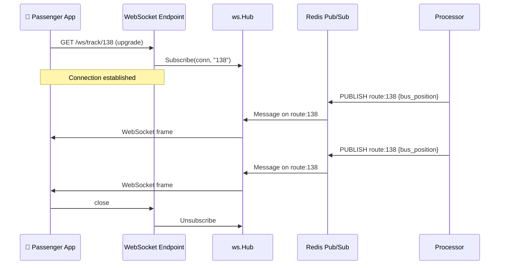

# Real-Time Tracking

Passengers see buses moving on the map in real-time. Here's how positions flow from Redis to the phone screen.

## WebSocket Architecture



## WebSocket Hub

The Hub (`internal/ws/hub.go`) manages all active WebSocket connections:

- **Subscribe**: When a client connects to `/ws/track/{routeID}`, the Hub registers the connection for that route
- **Broadcast**: When a bus position update arrives via Pub/Sub, the Hub sends it to all connections subscribed to that route
- **Unsubscribe**: When a client disconnects, the Hub removes the registration

## Message Format

Each WebSocket message is a JSON object with the fused bus position:

```json
{
  "virtual_id": "v_001",
  "route_id": "138",
  "lat": 6.935,
  "lng": 79.875,
  "speed_kmh": 45.2,
  "bearing": 120.5,
  "contributor_count": 3,
  "confidence": "verified",
  "last_update": "2024-03-27T14:22:30Z"
}
```

### Confidence Levels

The `confidence` field tells the passenger how reliable the position is:

| Level | Contributors | Meaning |
|-------|-------------|---------|
| `low` | 1 | Single phone — position may drift |
| `good` | 2 | Two phones agree — reliable |
| `verified` | 3+ | Multiple phones — highly accurate |

## Redis Pub/Sub Bridge

The bridge (`cmd/server/main.go: runPubSubBridge`) connects Redis Pub/Sub to the WebSocket Hub:

1. Subscribes to `route:*` pattern (all route channels)
2. When a message arrives on `route:138`, extracts route ID `138`
3. Calls `hub.Broadcast("138", message)` to forward to WebSocket clients

## Bus Position Storage

Live positions are stored in Redis Hashes with a 5-minute TTL:

```
Key: bus:v_001:pos
Fields:
  lat       → 6.935
  lng       → 79.875
  speed     → 45.2
  bearing   → 120.5
  route_id  → 138
  count     → 3
  confidence → verified
TTL: 300 seconds
```

If no GPS update is received for 5 minutes, the bus position expires and the bus disappears from the map.

## REST Fallback

For clients that can't use WebSocket, two REST endpoints provide bus positions:

- `GET /api/v1/buses/active` — All currently tracked buses
- `GET /api/v1/buses/nearby?lat=6.9&lng=79.8&radius_km=10` — Buses near a location
