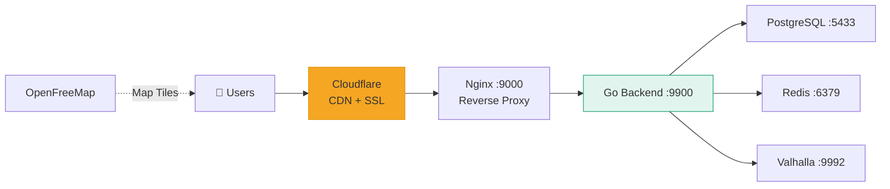

# Deployment

Mansariya runs on a single **Hetzner CX32** VPS (~$9/month) with Docker Compose, fronted by Cloudflare for CDN and SSL.

## Architecture



## Docker Compose

All services are defined in `infra/docker-compose.yml` with environment variables from `infra/.env`:

```bash
# Start everything
docker compose -f infra/docker-compose.yml --env-file infra/.env up -d

# Or use the Makefile shortcut
make infra-up-all
```

## Nginx

Nginx acts as a reverse proxy, handling:
- HTTP → backend proxy
- WebSocket upgrade (`/ws/` paths)
- Cloudflare SSL termination

A template is provided for environment-based config:
```bash
envsubst '${BACKEND_PORT} ${NGINX_PORT} ${SERVER_NAME}' \
  < infra/nginx/nginx.conf.template \
  > infra/nginx/nginx.conf
```

## Server Sizing

| Resource | CX32 | Mansariya Usage |
|----------|------|-----------------|
| CPU | 4 vCPU | Go backend: 1 core, Valhalla: 2 cores |
| RAM | 8 GB | PostgreSQL: 2GB, Valhalla: 3GB, Redis: 512MB |
| Disk | 80 GB SSD | Valhalla tiles: ~5GB, PostgreSQL: ~1GB |
| Bandwidth | 20 TB | Minimal (JSON APIs + WebSocket) |

## Cost Breakdown

| Item | Monthly Cost |
|------|-------------|
| Hetzner CX32 VPS | ~$9 |
| Cloudflare (free plan) | $0 |
| OpenFreeMap tiles | $0 |
| Domain (masariya.lk) | ~$1 |
| **Total** | **~$10/month** |
