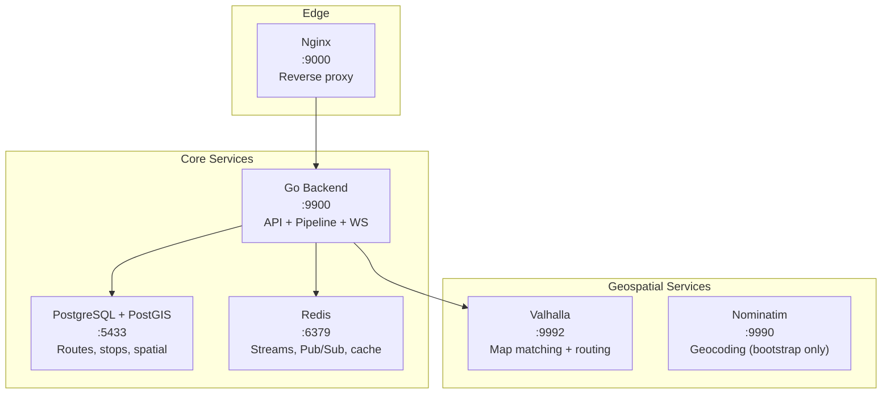

# Services

Mansariya uses six services, all orchestrated via Docker Compose.

## Service Map

## PostgreSQL + PostGIS

| Property | Value |
|----------|-------|
| Image | `postgis/postgis:16-3.4` |
| Port | 5433 (host) → 5432 (container) |
| Extensions | PostGIS, pg_trgm |

Stores routes, stops, route_stops, timetables, and trip segments. PostGIS enables spatial queries (nearby stops, route polylines). pg_trgm powers fuzzy trilingual search.

## Redis

| Property | Value |
|----------|-------|
| Image | `redis:7-alpine` |
| Port | 6379 |

Three usage patterns:
- **Streams**: `gps:raw` and `gps:matched` for pipeline processing (consumer groups)
- **Pub/Sub**: `route:{id}` channels for live broadcast to WebSocket clients
- **Hash**: `bus:{vid}:pos` for current bus positions (5-min TTL)

## Valhalla

| Property | Value |
|----------|-------|
| Image | Custom (based on `gis-ops/docker-valhalla`) |
| Port | 9992 |
| Data | Sri Lanka OSM extract (~120MB) |

Self-hosted routing engine providing:
- `trace_route` — Map matching (GPS → road-snapped points)
- `route` — Turn-by-turn routing between coordinates

## Nominatim

| Property | Value |
|----------|-------|
| Image | `mediagis/nominatim:4.4` |
| Port | 9990 |
| Data | Sri Lanka OSM extract |

Used only during **bootstrap** to geocode stop names → coordinates. Not needed at runtime.

<Info>
  Nominatim takes 5-10 minutes to import Sri Lanka data on first boot. The container uses ~1GB of shared memory (`shm_size: 1g`).
</Info>

## Nginx

| Property | Value |
|----------|-------|
| Port | 9000 |
| Upstream | Go backend at 127.0.0.1:9900 |

Handles HTTP reverse proxying and WebSocket upgrades. In production, Cloudflare sits in front for SSL termination and CDN.

## Go Backend

The Go backend is a **single binary** that runs:
- HTTP API server (Chi router)
- WebSocket server
- Pipeline workers (goroutines)
- Pub/Sub bridge

No separate worker processes — everything runs in one process for simplicity.
