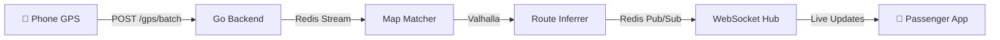

# Welcome to Mansariya

**Mansariya** is Sri Lanka's first crowdsource-powered real-time bus tracking system. Instead of installing GPS hardware on buses, passengers' smartphones become the sensors — making it free for operators and riders alike.

<CardGroup cols={2}>
  <Card title="Zero Hardware" icon="microchip">
    No GPS devices on buses. Passengers' phones do the tracking.
  </Card>
  <Card title="Free for Commuters" icon="hand-holding-dollar">
    $0 map stack with OpenFreeMap. ~$9/month server cost.
  </Card>
  <Card title="Trilingual" icon="language">
    Full support for Sinhala, Tamil, and English.
  </Card>
  <Card title="Privacy First" icon="shield-halved">
    No accounts needed. Device hashes rotate every 24 hours. Raw GPS discarded in 10 minutes.
  </Card>
</CardGroup>

## How It Works — In 30 Seconds

1. **Contributors** ride the bus with the Mansariya app open — their phone GPS is sent to the backend.
2. The **pipeline** map-matches the GPS trace to roads, infers which bus route the device is on, and fuses multiple contributors into a single bus position.
3. **Passengers** open the app and see live bus positions, ETAs, and journey plans — all powered by the crowd.

## Key Numbers

| Metric | Value |
|--------|-------|
| Server cost | ~$9/month (Hetzner CX32) |
| Map cost | $0 (OpenFreeMap) |
| GPS processing latency | < 2 seconds |
| Position update interval | 5 seconds |
| Privacy: raw GPS retention | 10 minutes max |

## Quick Links

<CardGroup cols={3}>
  <Card title="Architecture" icon="sitemap" href="/architecture">
    System design and data flow
  </Card>
  <Card title="Quickstart" icon="rocket" href="/quickstart">
    Run locally in 5 minutes
  </Card>
  <Card title="API Reference" icon="code" href="/api-reference/overview">
    Full REST + WebSocket API docs
  </Card>
</CardGroup>
