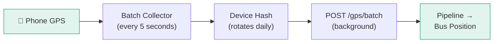

# Contributing GPS

Every passenger with Mansariya becomes a GPS sensor. Here's how the app collects and sends location data.

## How It Works



## GPS Collection

The app uses `react-native-geolocation-service` to collect GPS at 5-second intervals:

| Setting | Value |
|---------|-------|
| Update interval | 5 seconds |
| Minimum accuracy | 25 meters |
| Batch size | 10-20 pings per request |
| Background mode | Supported (when tracking) |

## Privacy Protections

<CardGroup cols={2}>
  <Card title="No Account Required" icon="user-slash">
    No login, no email, no phone number. The device is the identity.
  </Card>
  <Card title="Rotating Device Hash" icon="rotate">
    Device UUID is hashed with a daily salt. Cannot be linked across days.
  </Card>
  <Card title="GPS Discarded Fast" icon="clock">
    Raw GPS pings are discarded within 10 minutes after processing.
  </Card>
  <Card title="Opt-In Only" icon="toggle-on">
    GPS is only sent when the user actively has tracking enabled.
  </Card>
</CardGroup>

## What Gets Sent

Each GPS batch contains only:

```json
{
  "device_hash": "daily-rotating-hash",
  "session_id": "random-session-id",
  "pings": [
    {
      "lat": 6.9271,
      "lng": 79.8612,
      "ts": 1711540800,
      "acc": 12.5,
      "spd": 8.3,
      "brg": 45.0
    }
  ]
}
```

**What is NOT sent:**
- Device UUID (only a rotating hash)
- User identity
- Phone model or OS version
- Which routes the user has viewed
- Any personal information
