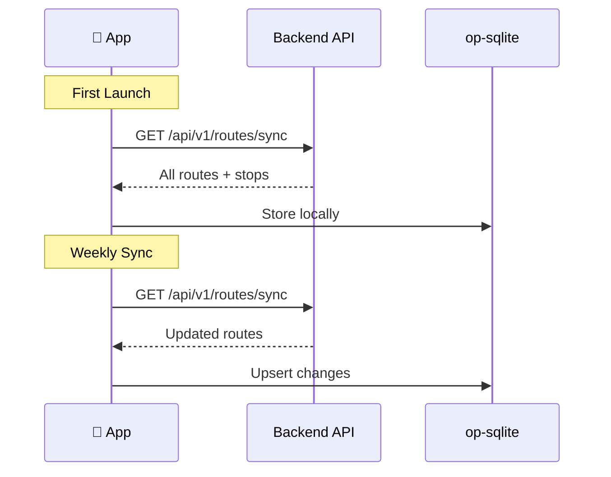

# Offline-First Architecture

Many Sri Lankan commuters have intermittent connectivity. Mansariya is designed to be useful even offline.

## What Works Offline

| Feature | Offline? | How |
|---------|----------|-----|
| View routes & stops | Yes | Cached in op-sqlite |
| Search routes | Yes | Local fuzzy search |
| View route polylines | Yes | Cached geometry |
| Live bus positions | No | Requires WebSocket |
| GPS contribution | Queued | Batches stored, sent when online |
| Journey planning | Partial | Routes available, no live ETAs |

## Sync Strategy

### First Launch
The app calls `/api/v1/routes/sync` and stores all routes and stops in the local op-sqlite database.

### Weekly Refresh
Every 7 days, the app re-syncs to pick up new routes, renamed stops, or deactivated services.

## GPS Queue

When the user is contributing GPS data but loses connectivity:

1. GPS observations are batched locally (up to 100 pings)
2. When connectivity returns, queued batches are sent to `/api/v1/gps/batch`
3. The pipeline processes them normally (timestamps are preserved)

## Local Storage

All user preferences are stored on-device:
- Saved routes
- Language preference
- Trip counter
- Onboarding completion state

<Warning>
  No user data is ever sent to the server. The device IS the identity — there are no user accounts in MVP.
</Warning>
