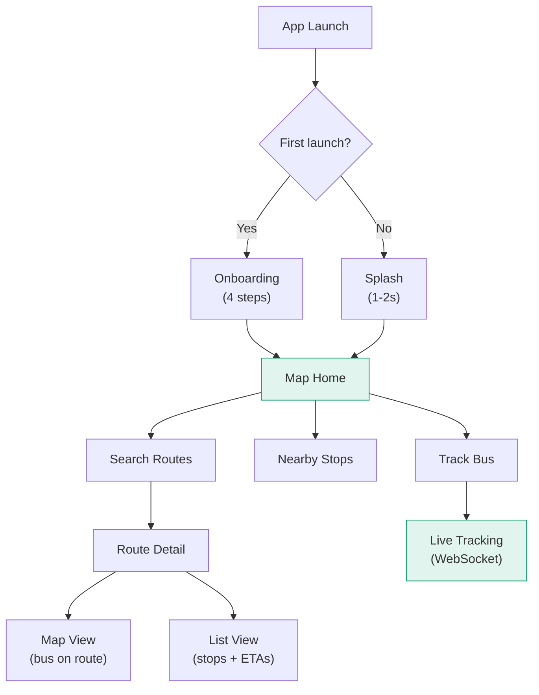

# Mobile App

The Mansariya mobile app is built with **React Native** (bare workflow) and TypeScript, targeting Android as the primary platform (95%+ of Sri Lankan smartphones).

## Tech Stack

| Layer | Technology |
|-------|-----------|
| Framework | React Native (bare workflow) |
| Language | TypeScript (strict mode) |
| Maps | MapLibre via `@maplibre/maplibre-react-native` |
| Map Tiles | OpenFreeMap (free, no API key) |
| State | Zustand |
| Navigation | React Navigation (native stack + bottom tabs) |
| Offline DB | op-sqlite |
| i18n | i18next + react-native-localize |
| Location | react-native-geolocation-service |
| HTTP | Axios |

## App Flow



### Onboarding (First Launch Only)

1. **Welcome** — Introduce Mansariya
2. **How it works** — Explain crowdsource tracking
3. **Language** — Choose Sinhala, Tamil, or English
4. **Location** — Request GPS permission

## Project Structure

```
mobile/src/
├── components/          # Reusable UI components
│   ├── map/            # MapView, BusMarker, RoutePolyline
│   ├── route/          # RouteCard, StopList, ETABadge
│   └── common/         # Button, Card, Badge, BottomSheet
├── screens/            # App screens
│   ├── HomeScreen      # Map with nearby routes
│   ├── SearchScreen    # Route search
│   ├── RouteDetail     # Route map + stop list
│   └── SettingsScreen  # Language, about
├── stores/             # Zustand state stores
│   ├── routeStore      # Routes, search results
│   ├── locationStore   # User location
│   └── settingsStore   # Language, preferences
├── services/           # External integrations
│   ├── api.ts          # REST API client
│   ├── websocket.ts    # WebSocket manager
│   ├── location.ts     # GPS tracker
│   └── offline.ts      # SQLite cache
├── i18n/               # Translations
│   ├── en.json         # English
│   ├── si.json         # Sinhala
│   └── ta.json         # Tamil
├── constants/          # API URLs, map config, colors
└── navigation/         # React Navigation setup
```

## Design System

The app follows a custom design system with these brand colors:

| Token | Hex | Usage |
|-------|-----|-------|
| Mansariya Green | `#1D9E75` | Primary CTAs, verified badges |
| Green Light | `#E1F5EE` | Badge backgrounds |
| Green Dark | `#0F6E56` | Text on green backgrounds |
| Road Blue | `#378ADD` | Route polylines, location dot |
| Alert Amber | `#BA7517` | Low confidence warnings |
| Danger Red | `#E24B4A` | Stop tracking, alerts |

## Key Screens

### Home (Map View)
- Full-screen MapLibre map centered on user location
- Nearby bus stops shown as markers
- Bottom sheet with nearby routes and live bus counts

### Route Detail
- **Map view**: Route polyline with stop markers, live bus positions
- **List view**: Ordered stops with ETA for each approaching bus
- Tap a bus card to track that individual bus

### Journey Planner
- From/To autocomplete (trilingual)
- Shows all route options with fare, duration, and live bus info
